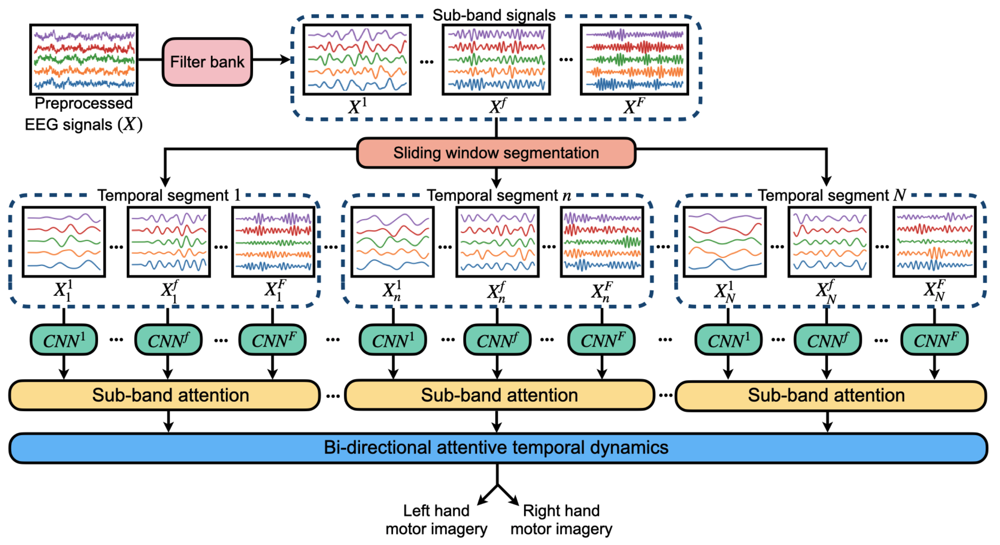

# Attention-Based Spatio-Temporal-Spectral Feature Learning for Subject-Specific EEG Classification

This repo contains the implementation of the 9th IEEE international winter conference on brain-computer-interface paper, [Attention-Based Spatio-Temporal-Spectral Feature Learning for Subject-Specific EEG Classification](https://ieeexplore.ieee.org/document/9385293).



## Abstract
> Brain-computer interface (BCI) is a system that recognizes the human intentions from the brain signals for communication with external devices. The electroencephalography (EEG) signals are commonly used for motor imagery based brain-computer interface (MI-BCI) due to non-invasive, cost-effective, and portable manner. For the analysis of the EEG signals, there are several machine learning and deep learning methods. However, the majority of those methods have limitations of not considering the distinct frequency bands for subject-specific manner. Therefore, we propose the method that pays attention to the significant frequency bands for each subject and also extracts the spatio-temporal-spectral features simultaneously. We utilize filter bank, sliding window segmentation, and the convolutional neural network (CNN) to extract the spatio-temporal features with consideration of multiple frequency bands. Then, we employ the sub-band attention to determine the significant information of each frequency band. Finally, the attention-based Bi-directional Long-Short Term Memory (Bi-LSTM) is implemented to extract the temporal dynamic features. Our proposed method is evaluated on the BCI Competition IV-2a dataset by using two classes in the subject-specific manner. The experimental results demonstrate that our proposed method is effective to focus on the significant frequency band for each subject.

## 1. Installation
### Environments
- Python == 3.7.10
- PyTorch == 1.9.0
- CUDA 11.0

### Dependencies
**Create conda environment**
```shell
conda env create —-file bci-2021.yaml
```

## 2. Folder Structure

## 3. Dataset

## 4. Get Started
**Training all subject**
```shell
sh runs/train_all_subject.sh
```

**Training single subject**
```shell
sh runs/train_single_subject.sh
```


## Citation
If you find this repository useful for your publications, please consider citing our paper.
```
@INPROCEEDINGS{ko2021bci,
  title={Attention-based spatio-temporal-spectral feature learning for subject-specific EEG classification}, 
  author={Ko, Dong-Hee and Shin, Dong-Hee and Kam, Tae-Eui},
  booktitle={2021 9th International Winter Conference on Brain-Computer Interface (BCI)},
  pages={1-4},
  year={2021}
}
```